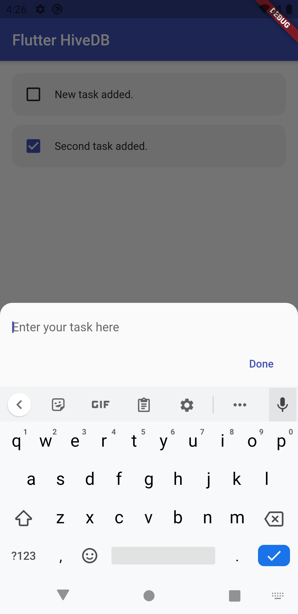
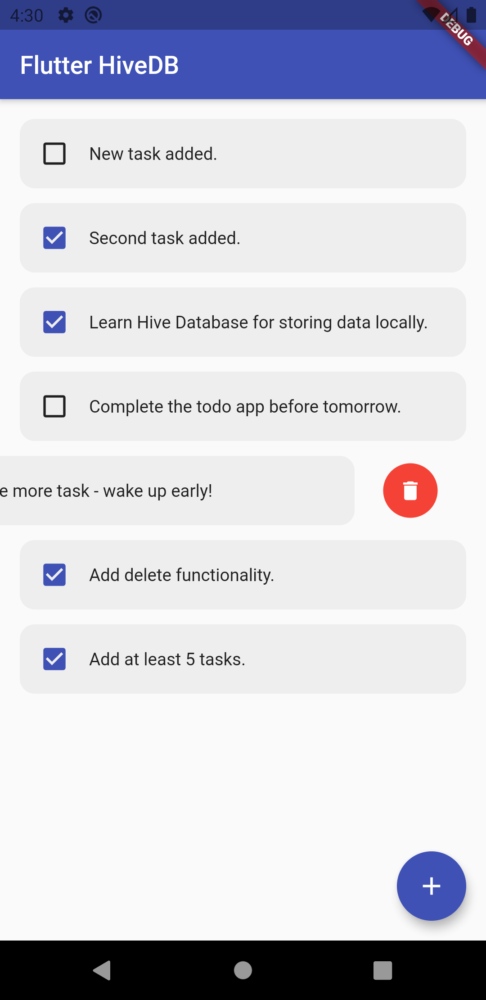

# Todo app with HiveDB

A Todo flutter application using Hive database.

## Screenshots

<table><tr>
<td style="text-align: center">

</td>
<td style="text-align: center">

</td>
</tr></table>

## Getting Started

For help getting started with Flutter, view our
[online documentation](https://flutter.dev/docs), which offers tutorials,
samples, guidance on mobile development, and a full API reference.

### If you like this repository, kindly give it a star ⭐
